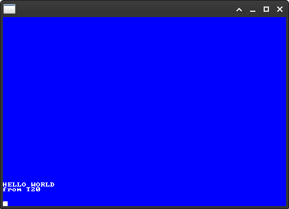

# T20

T20 is a two files utility to print and read strings on a rendered Opengl window.

<br>



<br>

---
## void T20Init(int rows, int cols, char *font_file)

Initialization function

**rows** : number of rows<br>
**cols** : number of cols<br>
**font_file** : optional font file, if NULL the builtin font will be used

<br>

---
## void T20Close()

Closing function, deallocate internal structures

<br>

---
## void T20Colors(int fgcolor, int bgcolor, int ctxcolor)

Set the desired colors in RGB format (ex: 0XAABBFF)

**fgcolor** : color of the font<br>
**bgcolor** : background color of the font<br>
**ctxcolor** : color of the fill bars if needed <br>

<br>

---
## int T20Run()

Return 0 if user requested quit (ESC key or closing window), 1 otherwise

<br>

---
## void T20Clear()

Clear the current content area (NOT the prompt)

<br>

---
## void T20AddLine(char *str)

Add a line to the current content area, all previous lines will be moved up by one
If the length of str is > number of cols, str will be splitted into multiple lines.

**str** : string to add

<br>

---
## char *T20ReadLine()

Returns a pointer to a copy of the prompt and clear it

**Note** : This function will not return until user press ENTER.\
If the user has requested to exit, this function will return NULL.

<br>

---
# Examples

Program to read from the prompt and mirror in the content area until the user has requested the exit.

```
//std
#include "stdlib.h"

//T20
#include "T20/T20.h"

//main
int main()
{
    T20Init(40, 80, NULL);

    T20Colors(0xFFFFFF, 0x0000FF, 0x000000);

    while(1)
    {
        char *str = T20ReadLine();
        
        if(!str) { break; }

        T20AddLine(str);

        free(str);
    }

    T20Close();

    return 0;
}
```

Program to continuously print on the content area until the user has requested the exit.

```
//std
#include "unistd.h"

//T20
#include "T20/T20.h"

//main
int main(void)
{
    T20Init(40, 80, 0);

    T20Colors(0xFFFFFF, 0x0000FF, 0x000000);

    while(T20Run())
    {
        sleep(1);

        T20AddLine("test");
    }

    T20Close();

    return 0;
}
```

---
**Note on fonts :**

T20 supports all the 1760 fonts availables here :

https://github.com/viler-int10h/vga-text-mode-fonts

---
**Note on tests :**

T20 has been tested with the following flags on Valgrind :

valgrind --leak-check=full --show-leak-kinds=all --track-origins=yes


